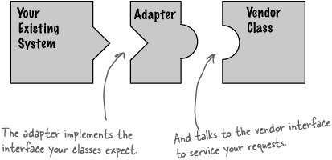

# 어댑터 패턴

어댑터 패턴이란 기존의 코드가 있고 그걸 사용하고 싶은데 사용자의 인터페이스에 맞게 사용하고 싶다면 하나의 어댑터를 만들어서 기존의 코드와 사용자의 인터페이스를 연결시켜주는 개념이다. 



다음과 같이 사용자가 기대하는 인터페이스에 맞게 어댑터를 구현함으로서 기존의 코드를 바꾸지 않고 사용하면서 인터페이스는 맞출 수 있게 된 것이다.

## Yuki의 코드

```java
// 기존코드인 Banner 클래스
public class Banner{
    private String string;
    public Banner(String string){
        this.string=string;
    }
    public void showWithParen(){
        System.out.println("(" + string + ")");
    }
    public void showWithAster(){
        System.out.println("*" + string + "*");
    }
}
```

```java
// 사용자가 원하는 인터페이스
public interface Print{
    public abstract void printWeak();
    public abstract void printStrong();
}
```

```java
// Banner와 Print를 연결시켜주는 어댑터
public class PrintBanner extends Banner implements Print{
    public PrintBanner(String string){
        super(string);
    }
    public void printWeak(){
        showWithParen();
    }
    public void printStrong(){
        showWithAster();
    }
}
```

```java
public class Adaptor{
    public static void main(String[] args){
        Print p = new PrintBanner("Hello");
        p.printWeak();
        p.printStrong();
    }
}
```

어댑터를 만들어 놓았기 때문에 단순히 Print 인터페이스로 함수를 구현하는 어댑터의 객체를 생성하여 원하는 함수를 사용하면 기존의 Banner 클래스를 바꾸지 않고 간단하게 사용할 수 있게 된다.
