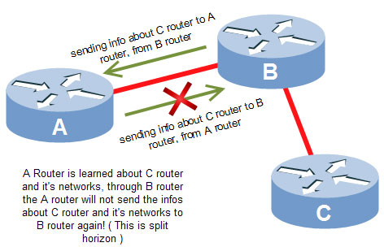

# Count-To-Infinity Problem

라우팅 알고리즘에서 DV(Distance-Vector) 알고리즘은 벨만-포드 알고리즘을 사용하는 라우팅 프로토콜로 모든 라우터가 네트워크 topology를 갖고 있지 않고 인접 라우터에 대한 정보로 source 라우터에서의 optimal path를 결정하는 방법이다. LS(Link State) 알고리즘과 다르게 communication overhead가 적다고 할 수 있지만 unreachable router에 대한 정보가 늦게 알려지는 slow convergence problem이 심각한 문제이다.

**Convergence되면 상관없지만 해당 정보를 알 때까지 무한대의 시간이 걸리는 경우가 있을 수 있는데, 이 문제를 count-to-infinity problem이라고 한다.** 

위와같은 topology가 있을 때 cost를 number of hops라고 하고 목적지를 A라고 할 경우 B,C,D,E의 초기값은 각각 1,2,3,4가 된다. 하지만 이후 A와 B의 연결이 끊겨서 unreachable하게 될 경우에 count-to-infinity problem이 발생한다.

* B는 A와의 연결이 끊어졌기 때문에 인접라우터인 C를 통해 A에 가려고 하므로 3이 된다. C,D,E는 그대로
* C는 인접라우터인 B가 업데이트 됐고 B와 D모두 A까지 3이 걸리므로 4가 된다. B,D,E는 그대로

이런 방식으로 계속 진행되면 A에 대한 cost값이 각가 증가하게 되고 결국 무한대의 시간이 지나야 A로의 cost가 무한대임을 알 수 있게 되고 그제서야 끊겼다는 것을 알게 되기 때문에 count-to-infinity problem이 발생하게 된다.

# 어떻게 해결하는가?

## 1. Maximum Hop Count의 제한

최대 홉 카운트를 15로 규정하게 되면 목적지까지의 홉 카운트가 15초과, 즉 16이상이 되는 라우팅 경로에 대해서는 unreachable로 간주하게 된다.

## 2. Split Horizon

위에서 설명한 문제점은 C가 B를 통과해 A로 가는 경로를 B에게 알려주었다는 아이러니에 있다. 따라서, B로부터 받은 정보는 B에게 다시 재전송하지 않는 것을 통해 두 라우터간의 루프를 방지할 수 있는데 이를 split horizon이라고 한다.

[그림 출처](https://wiki.mikrotik.com/wiki/Split_horizon)

위 그림에선 A가 B로부터 B를 통해 C에 도달하는 경로에 대한 정보를 받았다면, 다시 그 정보를 B에게 되돌려주지 않는다는 점을 설명하고 있다.

## 3. Route Poisoning

위 그림에서 `10.4.0.0`의 네트워크가 끊어졌을 경우 해당 정보를 인접 라우터에게 metric을 16으로 해서 보내게 되면 인접라우터들도 `10.4.0.0`에 도달할 수 없다는 것을 알게 되며 이를 route poisoning이라고 한다.

## 4. Poison Reverse

Route poisoning을 받은 라우터들이 `10.4.0.0`으로 갈 수 있는 다른 경로를 알아냈다면 unreachable 정보를 준 라우터에게 다시 보내지만 발견하지 못했다면 확실히 unreachable하다고 다시 보내준다.

## 5. Hold-Down

`10.4.0.0`이 끊어질 경우 hold-down timer라고 불리는 타이머가 동작하면서 일정 시간 후에 해당 네트워크에 대한 라우팅 테이블을 갱신하는 기법이다. 일정 시간 전에 라우팅 테이블을 갱신하게 되면 루프가 발생할 수 있기 때문에 이를 방지하기 위한 것이다.

## 6. Triggered Update

네트워크가 끊어지는 정보를 즉각 전송함으로써 잘못된 라우팅 정보를 사전에 차단하는 기법이다.

### PPT 사진 출처

* http://surak.hanrw.ac.kr:8080/%EA%B7%BC%EA%B1%B0%EB%A6%AC%20%ED%86%B5%EC%8B%A0%EB%A7%9D/%EA%B0%95%EC%9D%98%20%EB%85%B8%ED%8A%B8/8%EC%9E%A5%20RIP.pps